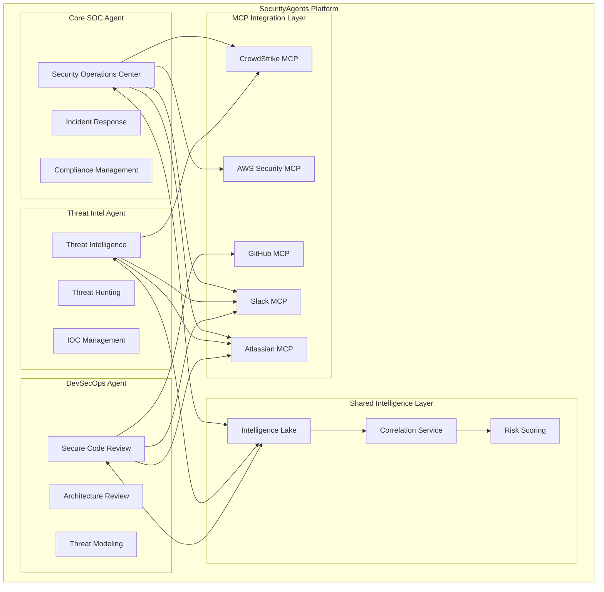

# SecurityAgents Multi-Agent Integration Architecture

**Purpose**: Unified agent collaboration framework for comprehensive enterprise security  
**Agents**: Core SOC + Threat Intel + DevSecOps  
**Integration**: Seamless cross-agent intelligence sharing and coordinated response

---

## Agent Collaboration Framework

### **Agent Ecosystem Overview**



### **Intelligence Sharing Architecture**

```yaml
shared_intelligence_layer:
  purpose: "Centralized intelligence correlation and cross-agent communication"
  
  intelligence_lake:
    threat_data:
      - "IOCs with confidence scores and attribution"
      - "Threat actor profiles and campaign intelligence"
      - "Attack patterns and TTP correlation"
      - "Vulnerability intelligence and exploit availability"
    
    development_security:
      - "Code security findings with business context"
      - "Architecture security assessments and recommendations" 
      - "Supply chain risk intelligence and impact analysis"
      - "Security control effectiveness and coverage gaps"
    
    operational_data:
      - "Incident response timelines and lessons learned"
      - "Security tool effectiveness metrics and optimization"
      - "Compliance status and audit evidence"
      - "Team performance metrics and improvement opportunities"

  correlation_service:
    cross_domain_analysis:
      - "Development vulnerability correlation with threat intelligence"
      - "Production incident correlation with code security findings"
      - "Supply chain compromise correlation with infrastructure threats"
      - "Threat actor TTP correlation with secure development recommendations"
    
    risk_correlation:
      - "Business impact assessment across security domains"
      - "Asset criticality scoring with threat exposure analysis"
      - "Compliance risk correlation with security findings"
      - "Organizational risk posture optimization recommendations"

  automated_workflows:
    intelligence_routing:
      - "Relevant threat intelligence auto-distribution to development teams"
      - "Security finding escalation based on threat context"
      - "Cross-agent collaboration trigger based on intelligence correlation"
      - "Executive briefing automation with multi-domain intelligence"
```

## Cross-Agent Collaboration Scenarios

### **Scenario 1: Advanced Persistent Threat (APT) Response**

```yaml
scenario: "APT campaign targeting organization infrastructure and development environment"

agent_coordination:
  threat_intel_agent:
    phase_1_detection:
      - "IOC detection and threat actor attribution"
      - "Campaign timeline construction and TTP analysis"
      - "Infrastructure enumeration and prediction"
      - "Potential target identification and risk assessment"
    
    intelligence_sharing:
      - "Share threat actor profile with SOC and DevSecOps agents"
      - "Provide IOC feeds for proactive blocking"
      - "Deliver TTP-based hunting guidance"
      - "Update threat landscape context for all agents"
  
  soc_agent:
    phase_2_response:
      - "Infrastructure protection and IOC blocking"
      - "Incident response coordination and containment"
      - "Stakeholder notification via Slack integration"
      - "Compliance evidence collection and audit trail"
    
    coordination_activities:
      - "Request development environment analysis from DevSecOps"
      - "Coordinate threat hunting activities with Threat Intel"
      - "Manage incident timeline and stakeholder communication"
      - "Escalate based on business impact and threat intelligence"
  
  devsecops_agent:
    phase_3_hardening:
      - "Source code analysis for potential compromise indicators"
      - "Build pipeline security assessment and hardening"
      - "Developer workstation security validation"
      - "Supply chain analysis for potential compromise vectors"
    
    preventive_measures:
      - "Implement TTP-specific security controls in development pipeline"
      - "Update threat model based on APT campaign intelligence"
      - "Enhance security monitoring for development environment"
      - "Deploy additional security controls based on threat actor profile"

automated_coordination:
  slack_integration:
    - "Unified incident communication channel with all agent updates"
    - "Cross-agent coordination and status synchronization"
    - "Executive briefing automation with comprehensive intelligence"
    - "Team-specific notifications and action item distribution"
  
  atlassian_integration:
    - "Comprehensive incident documentation across all security domains"
    - "Cross-agent task coordination and progress tracking"
    - "Lessons learned documentation for future prevention"
    - "Compliance evidence collection and audit preparation"
```

### **Scenario 2: Supply Chain Compromise Detection**

```yaml
scenario: "Malicious package injection in open-source dependency"

agent_coordination:
  devsecops_agent:
    phase_1_detection:
      - "OSS vulnerability scanning identifies suspicious package behavior"
      - "Supply chain analysis detects package maintainer compromise"
      - "Code review automation identifies potential malicious code injection"
      - "Build pipeline analysis detects unauthorized package installation"
    
    immediate_response:
      - "Automated package blocking across development environment"
      - "Developer notification and guidance via Slack integration"
      - "Impact assessment across application portfolio"
      - "Alternative package recommendation and migration guidance"
  
  threat_intel_agent:
    phase_2_intelligence:
      - "Threat actor attribution and campaign correlation"
      - "IOC extraction and intelligence sharing"
      - "Similar compromise detection across other packages"
      - "Threat landscape update and predictive analysis"
    
    proactive_defense:
      - "Proactive package monitoring based on threat actor patterns"
      - "Supply chain threat intelligence sharing with industry partners"
      - "Package ecosystem monitoring and early warning system"
      - "Threat briefing preparation for development and security teams"
  
  soc_agent:
    phase_3_governance:
      - "Incident response coordination and documentation"
      - "Compliance impact assessment and reporting"
      - "Stakeholder communication and executive briefing"
      - "Lessons learned integration and policy update recommendations"

cross_agent_intelligence:
  shared_context:
    - "Package compromise IOCs shared for infrastructure monitoring"
    - "Threat actor TTPs integrated into secure development guidelines"
    - "Supply chain risk intelligence shared for proactive detection"
    - "Incident response patterns shared for future automation"
  
  coordinated_response:
    - "Multi-domain incident response with unified communication"
    - "Cross-agent task coordination and progress synchronization"
    - "Comprehensive threat briefing with development and operational context"
    - "Executive reporting with business impact and remediation status"
```

## Technical Integration Framework

### **Agent Communication Protocol**

```yaml
inter_agent_communication:
  message_format:
    standard_fields:
      - "agent_id: unique identifier for sending agent"
      - "message_type: intelligence, task_request, status_update, alert"
      - "priority: low, medium, high, critical"
      - "correlation_id: link related messages across agents"
      - "timestamp: ISO 8601 timestamp with timezone"
      - "metadata: agent-specific context and enrichment data"
    
    intelligence_sharing:
      threat_intelligence:
        - "iocs: list of indicators with confidence scores"
        - "threat_actor: attributed threat actor with confidence"
        - "campaign: campaign identification and context"
        - "ttps: MITRE ATT&CK techniques and procedures"
        - "recommendations: actionable intelligence for other agents"
      
      security_findings:
        - "vulnerabilities: identified security issues with severity"
        - "affected_assets: impacted systems and applications"
        - "business_impact: risk scoring and business context"
        - "remediation: recommended actions and timeline"
      
      operational_status:
        - "incidents: active incident status and coordination needs"
        - "tasks: cross-agent task requests and dependencies"
        - "metrics: performance and effectiveness measurements"
        - "alerts: real-time notifications requiring attention"

  routing_logic:
    intelligence_distribution:
      - "Threat intelligence auto-routed to all agents"
      - "Development security findings routed to SOC for compliance"
      - "Incident status updates distributed to all relevant agents"
      - "Critical alerts broadcast to all agents with priority handling"
    
    task_coordination:
      - "Cross-agent task requests with dependency management"
      - "Resource conflict resolution and scheduling optimization"
      - "Progress synchronization and milestone coordination"
      - "Escalation handling for blocked or failed tasks"
```

### **MCP Integration Strategy**

```yaml
enhanced_mcp_integration:
  shared_mcp_services:
    slack_coordination:
      unified_channels:
        - "#security-operations: SOC agent incident management"
        - "#threat-intelligence: Threat intel briefings and IOC sharing"
        - "#devsecops: Development security findings and guidance"
        - "#security-leadership: Executive briefings and cross-agent coordination"
      
      cross_agent_features:
        - "Unified incident threads with multi-agent contributions"
        - "Intelligence sharing workflows with automatic distribution"
        - "Executive summary automation with comprehensive context"
        - "Team-specific notifications based on agent expertise"
    
    atlassian_coordination:
      unified_documentation:
        - "Cross-agent incident documentation in Confluence"
        - "Shared threat intelligence knowledge base"
        - "Comprehensive security architecture documentation"
        - "Cross-domain lessons learned and best practices"
      
      task_coordination:
        - "Jira integration for cross-agent task dependencies"
        - "Project coordination across security domains"
        - "Compliance evidence collection and audit preparation"
        - "Risk management and mitigation tracking"

  agent_specific_mcp_usage:
    threat_intel_enhancements:
      - "OSINT source integration via custom MCP connectors"
      - "Threat feed aggregation and correlation automation"
      - "Industry threat sharing via STIX/TAXII MCP integration"
      - "Dark web monitoring and intelligence gathering"
    
    devsecops_enhancements:
      - "Advanced GitHub integration beyond basic security features"
      - "Container registry security integration and monitoring"
      - "CI/CD pipeline security validation and enforcement"
      - "Developer security training integration and tracking"
    
    soc_enhancements:
      - "Advanced CrowdStrike integration with custom hunting queries"
      - "AWS security service integration for cloud threat detection"
      - "SIEM integration for log correlation and analysis"
      - "Compliance framework integration for automated evidence collection"
```

## Performance & Scalability Considerations

### **Agent Resource Management**

```yaml
resource_optimization:
  computational_efficiency:
    parallel_processing:
      - "Independent agent processing for non-conflicting tasks"
      - "Shared resource pools for common computations"
      - "Load balancing across agent workloads"
      - "Priority-based resource allocation for critical tasks"
    
    intelligence_caching:
      - "Shared intelligence cache for common threat data"
      - "Efficient correlation algorithms for cross-agent analysis"
      - "Intelligent data retention and archival policies"
      - "Memory optimization for large-scale intelligence processing"

  scalability_design:
    horizontal_scaling:
      - "Agent instance scaling based on workload demands"
      - "Geographic distribution for global organization support"
      - "Multi-tenant architecture for service provider deployment"
      - "Cloud-native deployment with auto-scaling capabilities"
    
    performance_monitoring:
      - "Agent performance metrics and optimization recommendations"
      - "Cross-agent coordination efficiency measurement"
      - "Resource utilization tracking and capacity planning"
      - "SLA monitoring and performance guarantee validation"
```

## Implementation Roadmap

### **Phase 1: Agent Foundation (Week 1-4)**
- [ ] **Week 1-2**: Threat Intel Agent core development (OSINT, IOC management)
- [ ] **Week 3-4**: DevSecOps Agent core development (secure code review, architecture analysis)

### **Phase 2: Intelligence Integration (Week 5-8)**
- [ ] **Week 5-6**: Shared intelligence layer development and agent communication protocol
- [ ] **Week 7-8**: Cross-agent correlation service and risk scoring integration

### **Phase 3: Advanced Collaboration (Week 9-12)**
- [ ] **Week 9-10**: Complex scenario automation (APT response, supply chain compromise)
- [ ] **Week 11-12**: Enhanced MCP integration and Slack/Atlassian collaboration workflows

### **Phase 4: Production Optimization (Week 13-16)**
- [ ] **Week 13-14**: Performance optimization and scalability enhancements
- [ ] **Week 15-16**: Enterprise deployment validation and success metrics achievement

---

## Success Metrics

| Metric | Target | Measurement Method |
|--------|--------|--------------------|
| **Cross-Agent Intelligence Accuracy** | >95% relevant intelligence sharing | Manual validation of cross-agent recommendations |
| **Response Coordination Speed** | <15 minutes for critical incidents | End-to-end incident response timeline |
| **False Positive Reduction** | <10% false positives through correlation | Agent-specific false positive tracking |
| **Threat Detection Coverage** | >90% threat scenario coverage | Comprehensive threat scenario testing |
| **Business Risk Correlation** | >85% accurate business impact scoring | Business stakeholder validation |

---

*Multi-agent architecture designed for seamless collaboration and comprehensive enterprise security coverage*