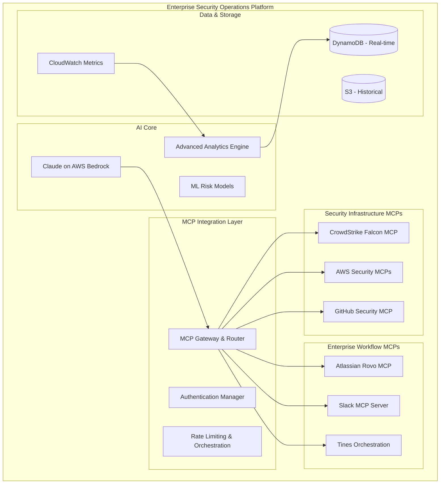
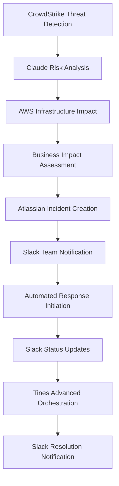

# SecurityAgents Enterprise Architecture

*Comprehensive AI-powered security operations platform for enterprise cyber defense*

**Version**: 2.0 - Enterprise Scale  
**Date**: 2026-03-05  
**Status**: Foundation validated, scaling to enterprise deployment

---

## Executive Summary

Building on our proven local prototype that successfully identified 10 security findings across multiple domains, we're now scaling to a comprehensive enterprise security operations platform. The architecture leverages Claude on AWS Bedrock with a comprehensive MCP ecosystem including CrowdStrike, AWS, GitHub, Atlassian, and **Slack** for complete security workflow automation.

### **Validated Foundation**
✅ **Local Prototype Proven**: Successfully analyzed GitHub repositories, identified real security issues  
✅ **Multi-Domain Coverage**: Secrets, code security, dependencies, configuration analysis working  
✅ **Structured Reporting**: Framework mapping and actionable findings validated  
✅ **AI Integration**: Claude analysis and classification capabilities confirmed

---

## Enterprise Architecture Overview

### **Core Platform Architecture**



### **Integration Ecosystem**

| Platform | MCP Server | Capabilities | Security Use Cases |
|----------|------------|-------------|-------------------|
| **CrowdStrike** | falcon-mcp (Official) | 13 modules, 40+ tools, FQL queries | Real-time threat detection, incident investigation, IOC management |
| **AWS** | aws-mcp (Official) | 66+ servers, full API coverage | Infrastructure security, CloudTrail analysis, IAM monitoring |
| **GitHub** | github-mcp + DevSecOps | SAST/DAST/SCA, dependency scanning | Code security, supply chain analysis, DevSecOps integration |
| **Atlassian** | atlassian-rovo-mcp (Official) | Jira + Confluence + Compass | Incident tracking, runbook management, asset relationships |
| **Slack** | slack-mcp (Official) | Messaging, search, canvases, users | Security team collaboration, real-time notifications, status updates |
| **Tines** | tines-api | Advanced workflow orchestration | Complex incident response, multi-tool coordination |

---

## Slack Integration Architecture

### **Slack MCP Server Capabilities**

Based on official Slack documentation, the Slack MCP server provides comprehensive enterprise collaboration features:

#### **Core Features**
```yaml
slack_mcp_capabilities:
  messaging:
    - send_messages: "Send messages to any conversation in Slack"
    - draft_messages: "Draft, format, and preview messages in AI clients"
    - read_channels: "Grab complete message history of channels"
    - read_threads: "Grab complete message thread conversations"
  
  search:
    - search_messages: "Search messages and files with filtering by date, user, content"
    - search_users: "Find users by name, email, ID with partial matching"
    - search_channels: "Filter channels by name and description"
  
  collaboration:
    - manage_canvases: "Create/update rich formatted documents"
    - read_canvases: "Export canvases as markdown files"
    - user_management: "Access complete user profiles, custom fields, statuses"
```

#### **Security-Focused Slack Integration**

```yaml
security_workflows:
  incident_notifications:
    critical_alerts:
      - channel: "#security-critical"
      - recipients: ["@security-team", "@on-call-engineer"]
      - format: "Structured incident summary with severity, impact, actions"
    
    status_updates:
      - channel: "#security-incidents"
      - format: "Real-time incident progress updates"
      - threading: "Maintain incident thread continuity"
  
  team_coordination:
    escalation_management:
      - auto_mention: "Based on incident severity and business impact"
      - role_based_routing: "SOC analysts, IR team, management"
      - external_coordination: "Vendor support, legal, PR teams"
    
    knowledge_sharing:
      - threat_intelligence: "Share IOCs and campaign updates"
      - lessons_learned: "Post-incident analysis and improvements"
      - security_awareness: "Team training and security updates"
  
  compliance_automation:
    audit_trails:
      - incident_documentation: "Automated incident timeline in threads"
      - decision_tracking: "Record approval decisions and rationale"
      - evidence_preservation: "Link to investigation artifacts"
    
    reporting:
      - executive_summaries: "Weekly security posture to leadership"
      - metrics_dashboards: "Security KPIs and trend analysis"
      - compliance_status: "Framework compliance updates"
```

### **Slack MCP Technical Integration**

#### **Authentication & Security**
```yaml
slack_oauth_config:
  authentication: "OAuth 2.0 with confidential client"
  required_scopes:
    - "search:read.public, search:read.private"  # Message search
    - "chat:write"                               # Send notifications
    - "channels:history, groups:history"         # Read incident channels
    - "canvases:read, canvases:write"           # Manage incident runbooks
    - "users:read, users:read.email"           # Team member information
  
  security_controls:
    app_approval: "Workspace admin approval required"
    audit_logging: "Full MCP activity audit trail"
    rate_limits: "Tier 2-4 limits per tool (20-100+ per minute)"
    data_access: "Only approved channels and authorized users"
```

#### **Rate Limiting & Performance**
```yaml
rate_limits:
  search_operations: "Special limits - consult Slack documentation"
  messaging: "Special limits with burst capacity"
  channel_reads: "Tier 3: 50+ per minute"  
  canvas_operations: "Tier 2-4: 20-100+ per minute"
  user_operations: "Tier 4: 100+ per minute"

performance_optimization:
  caching: "User and channel metadata caching"
  batching: "Batch multiple operations when possible"
  intelligent_routing: "Route based on urgency and rate limit availability"
```

---

## Enhanced Use Case Architecture

### **UC-001E: Enterprise Threat Detection & Response with Slack**

**Enhanced Workflow**:


**Slack Integration Points**:
```yaml
slack_workflow:
  initial_notification:
    channel: "#security-alerts"
    format: |
      🚨 **CRITICAL SECURITY INCIDENT** 
      **Severity**: {severity}
      **Asset**: {affected_system}
      **Threat**: {threat_description}
      **Impact**: {business_impact}
      **Incident ID**: {jira_ticket_id}
      **Response Team**: @security-team @{asset_owner}
      
      📋 **Immediate Actions**:
      {automated_containment_actions}
      
      🧵 **Thread**: Updates will be posted here
  
  progress_updates:
    threading: "Maintain incident thread"
    milestones:
      - containment_complete: "✅ Threat contained - {timestamp}"
      - investigation_started: "🔍 Forensic analysis initiated"
      - root_cause_identified: "📋 Root cause: {cause_summary}"
      - remediation_complete: "✅ Incident resolved - {resolution_summary}"
  
  escalation_logic:
    critical_incidents:
      - mention: "@security-leadership @ciso"
      - channel: "#executive-security"
      - canvas: "Create incident war room canvas"
    
    extended_duration:
      - "30min": "Remind @on-call-manager"  
      - "2hr": "Escalate to @security-director"
      - "4hr": "Executive notification required"
```

### **UC-002E: Vulnerability Management with Team Coordination**

**Slack Integration**:
```yaml
vulnerability_workflows:
  discovery_notification:
    channel: "#security-vulnerabilities"
    format: |
      🔍 **NEW VULNERABILITIES DETECTED**
      **Repository**: {repo_name}
      **Critical**: {critical_count} | **High**: {high_count}
      **Top Priority**: {highest_severity_vuln}
      
      📊 **Risk Assessment**:
      Business Impact: {business_impact_score}
      Exploit Available: {exploit_status}
      Patch Available: {patch_status}
      
      👥 **Assigned**: @{dev_team} @{security_owner}
      📋 **Jira**: {ticket_link}
  
  remediation_tracking:
    dev_team_channels: "Targeted notifications to responsible teams"
    progress_updates: "Daily summaries of patch status"
    sla_monitoring: "Automatic reminders for SLA compliance"
```

---

## Data Architecture & Security

### **Enterprise Data Flow**

```yaml
data_architecture:
  real_time_processing:
    ingestion: "CrowdStrike + AWS + GitHub events"
    processing: "Claude analysis on AWS Bedrock"
    storage: "DynamoDB for fast retrieval"
    notification: "Slack for immediate team awareness"
  
  historical_analytics:
    storage: "S3 for long-term analysis"
    processing: "EMR for trend analysis and ML training"
    reporting: "CloudWatch dashboards + Slack summaries"
  
  compliance_data:
    evidence_collection: "Automated from all integrated platforms"
    storage: "Immutable S3 storage with legal hold capability"
    access_control: "IAM-based with audit logging"
    reporting: "Confluence documentation + Slack compliance updates"
```

### **Security & Privacy Controls**

```yaml
security_controls:
  data_encryption:
    at_rest: "AES-256 encryption for all storage"
    in_transit: "TLS 1.3 for all MCP communications"
    key_management: "AWS KMS with key rotation"
  
  access_control:
    authentication: "IAM-based with MFA required"
    authorization: "Role-based access with least privilege"
    slack_permissions: "Workspace admin approval + scope-limited OAuth"
  
  audit_compliance:
    logging: "Complete CloudTrail + MCP audit trails"
    monitoring: "Real-time security monitoring of platform itself"
    compliance: "SOC 2 Type II + ISO 27001 alignment"
    slack_audit: "Full MCP activity audit via Slack audit logs"
```

---

## Deployment Architecture

### **Multi-Environment Strategy**

```yaml
environments:
  development:
    scope: "Local prototype + limited MCP testing"
    data: "Synthetic test data only"
    slack: "Test workspace for development team"
  
  staging:
    scope: "Full MCP integration testing"
    data: "Limited production data for validation"
    slack: "Staging workspace mirroring production channels"
  
  production:
    scope: "Full enterprise deployment"
    data: "Complete production security data"
    slack: "Production workspace with full team access"
    redundancy: "Multi-AZ deployment with automated failover"
```

### **Scalability & Performance**

```yaml
scalability:
  compute:
    claude: "AWS Bedrock auto-scaling based on demand"
    mcp_gateway: "Containerized deployment with horizontal scaling"
    data_processing: "Serverless Lambda for event processing"
  
  data:
    dynamodb: "Auto-scaling with burst capacity"
    s3: "Unlimited storage with intelligent tiering"
    caching: "ElastiCache for frequently accessed data"
  
  networking:
    load_balancing: "Application Load Balancer with health checks"
    cdn: "CloudFront for static content and API acceleration"
    vpc: "Isolated VPC with private subnets for security"
```

---

## Implementation Roadmap

### **Phase 2A: AWS Bedrock + Core MCP Integration (Week 1-2)**

**Week 1: Cloud Foundation**
- [ ] AWS Bedrock Claude deployment and configuration
- [ ] VPC and security group setup for enterprise deployment
- [ ] DynamoDB and S3 data architecture implementation
- [ ] CloudWatch monitoring and alerting setup

**Week 2: Core MCP Integration** 
- [ ] CrowdStrike MCP server integration and testing
- [ ] AWS MCP server integration for infrastructure monitoring  
- [ ] MCP gateway development for authentication and rate limiting
- [ ] Initial threat detection workflow implementation

### **Phase 2B: Enterprise Workflow Integration (Week 3-4)**

**Week 3: Incident Management**
- [ ] Atlassian Rovo MCP integration (Jira + Confluence)  
- [ ] GitHub MCP integration for DevSecOps workflows
- [ ] Automated incident ticket creation and management
- [ ] Basic notification system implementation

**Week 4: Slack Integration**
- [ ] **Slack MCP server integration and OAuth setup**
- [ ] **Security team channel configuration and testing** 
- [ ] **Real-time incident notification workflows**
- [ ] **Thread-based incident status tracking**
- [ ] **Escalation logic based on severity and business impact**

### **Phase 2C: Advanced Analytics & Orchestration (Week 5-6)**

**Week 5: Intelligence Enhancement**
- [ ] Advanced threat correlation and risk scoring
- [ ] Business impact modeling and prioritization
- [ ] Predictive analytics for threat forecasting
- [ ] ML model training for false positive reduction

**Week 6: Workflow Orchestration**
- [ ] Tines integration for complex incident response
- [ ] Advanced Slack workflow automation (canvases, escalation)
- [ ] Compliance automation and framework mapping
- [ ] Enterprise reporting and dashboard development

---

## Success Criteria

### **Phase 2 Success Metrics**

| Metric | Target | Validation Method |
|--------|--------|------------------|
| **MCP Integration** | 5 platforms connected | CrowdStrike + AWS + GitHub + Atlassian + Slack |
| **Threat Detection** | <5 minute MTTD | End-to-end workflow timing |
| **Slack Collaboration** | Real-time notifications | Incident workflow testing |
| **False Positive Rate** | <20% (improvement from local) | Classification accuracy testing |
| **Automation Coverage** | >75% of security workflows | Manual intervention tracking |

### **Enterprise Readiness Criteria**

- [ ] **Security**: Complete audit trail and encryption at rest/transit
- [ ] **Compliance**: SOC 2 controls implemented and tested  
- [ ] **Scalability**: Handles 1000+ security events per hour
- [ ] **Reliability**: 99.9% uptime with automated failover
- [ ] **Team Adoption**: Security team actively using Slack integration

---

*Enterprise architecture ready for Phase 2A implementation - AWS Bedrock + Core MCP Integration*