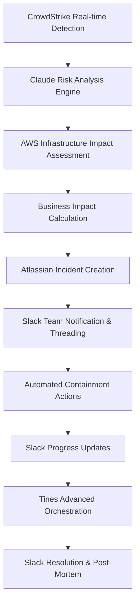
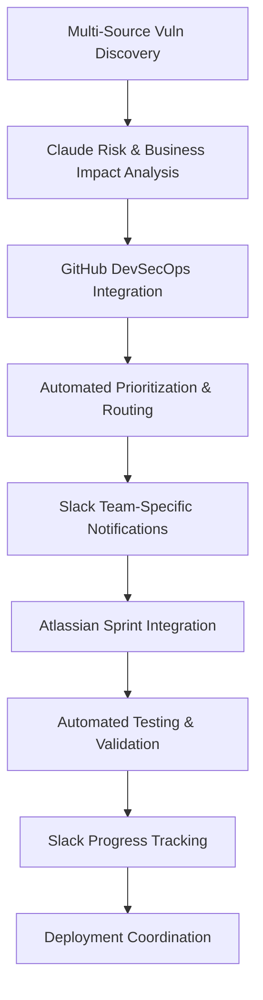

# SecurityAgents Enterprise Use Cases

*Comprehensive security automation use cases for enterprise deployment with Slack collaboration*

**Version**: 2.0 - Enterprise Scale  
**Date**: 2026-03-05  
**Foundation**: Local prototype validated with real security findings

---

## Use Case Evolution

### **From Local to Enterprise**

**✅ Proven Foundation** (Local Prototype):
- Multi-domain security analysis (secrets, code, dependencies, configuration)
- Structured finding classification with severity scoring  
- Framework mapping (NIST CSF 2.0 + ISO 27001/27002)
- Actionable remediation recommendations

**🚀 Enterprise Enhancement**:
- Real-time threat detection via CrowdStrike MCP
- Cloud infrastructure security via AWS MCP ecosystem  
- Team collaboration via Slack MCP integration
- Advanced orchestration via Tines workflows
- Complete audit trail and compliance automation

---

## TIER 1: Core Enterprise Security Operations

### UC-001E: Intelligent Threat Detection & Enterprise Response

#### Overview
**Objective**: Real-time threat detection with AI-powered analysis and coordinated enterprise response including security team collaboration via Slack

**Enhancement from Local**: Scales from GitHub analysis to enterprise-wide threat detection across all infrastructure with real-time team coordination

#### Technical Architecture



#### Enterprise Workflow Specification

**Step 1: Real-Time Threat Detection**
```yaml
crowdstrike_integration:
  detection_modules:
    - endpoint_detections: "Malware, suspicious processes, behavioral anomalies"
    - network_detections: "Lateral movement, C2 communications"
    - identity_protection: "Credential theft, privilege escalation"
    - cloud_security: "Container security, cloud workload protection"
  
  trigger_conditions:
    - severity: ["critical", "high"] 
    - confidence: ">= 0.7"
    - business_impact: "Critical assets affected"
```

**Step 2: Claude Intelligence Analysis**
```yaml
ai_analysis_engine:
  threat_correlation:
    - mitre_attack_mapping: "Tactics, techniques, procedures identification"
    - ioc_enrichment: "Reputation analysis, attribution, geographic origin"  
    - campaign_tracking: "Link to known threat actor campaigns"
    - business_context: "Asset criticality, data sensitivity, service impact"
  
  risk_scoring:
    factors:
      - technical_severity: 40%
      - business_impact: 35% 
      - threat_intelligence: 25%
    output: "Dynamic risk score 1-100 with confidence interval"
```

**Step 3: AWS Infrastructure Impact Assessment**
```yaml
aws_impact_analysis:
  cloudtrail_correlation:
    - recent_api_calls: "From affected hosts in last 24 hours"
    - privilege_escalation: "IAM role assumption patterns"
    - data_access: "S3, RDS, DynamoDB access from compromised systems"
  
  infrastructure_mapping:
    - network_topology: "VPC, subnet, security group analysis"
    - service_dependencies: "Connected services and downstream impact"
    - compliance_scope: "Affected compliance zones and data classifications"
```

**Step 4: Slack Enterprise Security Notifications**
```yaml
slack_notification_workflow:
  immediate_alert:
    channel: "#security-critical"
    format: |
      🚨 **CRITICAL SECURITY INCIDENT DETECTED**
      
      **📊 Incident Summary**
      • **ID**: {incident_id} | **Severity**: {risk_score}/100
      • **Asset**: {affected_systems}
      • **Threat Type**: {attack_classification}
      • **Business Impact**: {impact_assessment}
      
      **🎯 Threat Details** 
      • **MITRE TTPs**: {tactics_techniques}
      • **IOCs**: {indicators_of_compromise}
      • **Attribution**: {threat_actor_assessment}
      
      **⚡ Immediate Actions Taken**
      {automated_containment_summary}
      
      **👥 Response Team**: @security-team @{asset_owner} @{on_call_engineer}
      **📋 Jira Ticket**: {jira_incident_link}
      
      🧵 **Thread below for real-time updates**
    
    mentions:
      critical_severity: ["@security-team", "@security-leadership"] 
      high_severity: ["@security-team", "@{responsible_team}"]
      extended_duration: "@security-director (if >2 hours)"
  
  escalation_channels:
    executive: "#executive-security"  # For critical business impact
    vendor: "#vendor-coordination"   # For third-party involvement  
    legal: "#security-legal"         # For regulatory/legal implications
```

**Step 5: Threaded Status Updates**
```yaml
slack_threading_workflow:
  progress_milestones:
    containment_initiated:
      message: "🔒 **CONTAINMENT INITIATED** - {timestamp}\n• Actions: {containment_actions}\n• Systems isolated: {isolated_systems}"
    
    investigation_progress:
      message: "🔍 **INVESTIGATION UPDATE** - {timestamp}\n• Findings: {key_findings}\n• Scope: {affected_scope}\n• Next steps: {investigation_next_steps}"
    
    remediation_complete:
      message: "✅ **REMEDIATION COMPLETE** - {timestamp}\n• Resolution: {resolution_summary}\n• Preventive measures: {prevention_actions}\n• Lessons learned: {lessons_learned_link}"
  
  automated_updates:
    interval: "Every 30 minutes for critical incidents"
    content: "Investigation progress, new findings, containment status"
    format: "Structured updates with clear action items and ownership"
```

#### Framework Mapping

**NIST CSF 2.0 Enhanced Coverage**:
- **DETECT.AE-1**: *Baseline establishment* → CrowdStrike behavioral baselines + AWS normal patterns
- **DETECT.AE-2**: *Event analysis* → Claude AI analysis with MITRE ATT&CK mapping  
- **RESPOND.RS-1**: *Response personnel* → Slack-based role notification and coordination
- **RESPOND.CO-2**: *Incident communication* → Automated Slack threading and escalation

**ISO 27001/27002 Integration**:
- **Control 5.24**: *Incident planning* → Automated workflow initiation and team coordination
- **Control 5.25**: *Event assessment* → AI-driven severity and business impact analysis
- **Control 5.26**: *Incident response* → Orchestrated response via Tines + Slack coordination

#### Success Metrics

| Metric | Local Prototype | Enterprise Target | Enhancement |
|--------|----------------|-------------------|-------------|
| **Mean Time to Detection** | Manual analysis | <5 minutes | Real-time CrowdStrike integration |
| **Mean Time to Notification** | N/A | <2 minutes | Automated Slack alerting |
| **Team Coordination Time** | N/A | <10 minutes | Slack threading and mentions |
| **False Positive Rate** | 15% (GitHub analysis) | <10% | Enhanced AI context analysis |
| **Incident Documentation** | Manual | 100% automated | Slack threading + Jira integration |

---

### UC-002E: Enterprise Vulnerability Management with DevSecOps Integration

#### Overview
**Objective**: Continuous vulnerability assessment across enterprise infrastructure with automated DevSecOps integration and team coordination

**Enhancement from Local**: Scales from GitHub dependency scanning to full enterprise vulnerability management across cloud infrastructure, applications, and development pipelines

#### Technical Workflow



#### Enhanced Vulnerability Sources

```yaml
vulnerability_discovery:
  infrastructure:
    aws_inspector: "EC2, Lambda, container image vulnerabilities"
    crowdstrike_spotlight: "Endpoint vulnerabilities and configuration issues"
    aws_config: "Infrastructure configuration security issues"
  
  applications:
    github_security:
      - dependabot: "Dependency vulnerabilities across all repositories"
      - codeql: "SAST findings for custom applications"  
      - secret_scanning: "Hardcoded secrets and credentials"
    
    container_security:
      - ecr_scanning: "Container image vulnerabilities"
      - kubernetes_security: "EKS cluster security configurations"
  
  cloud_configuration:
    aws_security_hub: "Multi-service security findings"
    compliance_scanning: "CIS benchmarks, SOC 2 controls"
```

#### Slack DevSecOps Collaboration

```yaml
slack_devops_integration:
  team_routing:
    frontend_team:
      channel: "#frontend-security"
      mentions: "@frontend-leads @security-champion"
      focus: "JavaScript dependencies, XSS vulnerabilities, client-side security"
    
    backend_team:
      channel: "#backend-security" 
      mentions: "@backend-leads @database-admin"
      focus: "API security, SQL injection, authentication vulnerabilities"
    
    infrastructure_team:
      channel: "#infrastructure-security"
      mentions: "@sre-team @cloud-architects"
      focus: "AWS configuration, container security, network vulnerabilities"
  
  notification_format:
    critical_vulnerability: |
      🔴 **CRITICAL VULNERABILITY - IMMEDIATE ACTION REQUIRED**
      
      **📦 Component**: {component_name}
      **🎯 Vulnerability**: {vuln_description}
      **📊 CVSS Score**: {cvss_score}/10
      **🔥 Exploit Available**: {exploit_status}
      
      **💼 Business Impact**
      • **Affected Systems**: {affected_systems}
      • **Data at Risk**: {data_classification}
      • **Service Impact**: {service_impact_assessment}
      
      **⏰ SLA Requirements**
      • **Patch Deadline**: {patch_deadline}
      • **Testing Required**: {testing_requirements}
      • **Approval Needed**: {approval_workflow}
      
      **🔗 Resources**
      • **Jira Epic**: {jira_epic_link}
      • **Security Advisory**: {advisory_link}
      • **Patch Details**: {patch_information}
      
      **👥 Assigned**: {assigned_developers}
      
      🧵 **Thread for progress updates and questions**
```

---

### UC-003E: Enterprise Access Control & Identity Security

#### Overview
**Objective**: Comprehensive identity and access management with real-time privilege monitoring and automated compliance enforcement

**Enhancement from Local**: Scales from basic pattern detection to real-time IAM monitoring, privilege analytics, and automated access governance

#### Enhanced Capabilities

```yaml
enterprise_iam_monitoring:
  aws_iam_analysis:
    real_time_monitoring:
      - privilege_escalation: "CloudTrail analysis for suspicious role assumptions"
      - access_patterns: "Behavioral analysis for anomalous access"
      - policy_drift: "Automated detection of policy changes"
    
    compliance_enforcement:
      - least_privilege: "Automated right-sizing of permissions"
      - separation_of_duties: "Cross-role conflict detection"
      - access_certification: "Periodic access reviews and attestation"
  
  github_access_security:
    repository_permissions:
      - admin_access_monitoring: "Track repository admin assignments"
      - branch_protection: "Ensure main branch protection policies"
      - secret_access: "Monitor secrets and environment access"
```

#### Slack Access Governance Workflow

```yaml
slack_access_coordination:
  access_request_workflow:
    new_request: |
      🔐 **ACCESS REQUEST - APPROVAL NEEDED**
      
      **👤 Requestor**: {user_name} ({email})
      **🎯 Access Type**: {access_description}
      **📅 Duration**: {access_duration}
      **📋 Justification**: {business_justification}
      
      **🔍 Risk Assessment**
      • **Risk Level**: {risk_score}/100
      • **Data Access**: {data_classification_access}
      • **System Impact**: {system_impact_level}
      
      **✅ Approvals Required**
      • **Manager**: @{manager} - ⏳ Pending
      • **Security**: @{security_approver} - ⏳ Pending  
      • **System Owner**: @{system_owner} - ⏳ Pending
      
      **⚡ Auto-Approval Conditions**
      {auto_approval_criteria}
      
      🧵 **Thread for approval discussion and questions**
  
  privileged_access_alerts:
    unusual_activity: |
      ⚠️ **UNUSUAL PRIVILEGED ACCESS DETECTED**
      
      **👤 User**: {user_details}
      **🕒 Time**: {access_timestamp}  
      **🎯 Action**: {privileged_action}
      **📍 Source**: {source_location}
      
      **🤖 Risk Analysis**
      • **Anomaly Score**: {anomaly_score}/100
      • **Typical Pattern**: {normal_access_pattern}
      • **Deviation**: {access_deviation_description}
      
      **🔍 Investigation Required**: @security-team
      **📋 Incident**: {auto_generated_ticket}
```

---

## TIER 2: Advanced Enterprise Intelligence

### UC-004E: Enterprise Threat Intelligence & Campaign Tracking

#### Overview
**Objective**: Automated threat intelligence collection, analysis, and operationalization across enterprise security infrastructure with team collaboration

#### Slack Threat Intelligence Workflow

```yaml
threat_intelligence_slack:
  daily_briefings:
    channel: "#threat-intelligence"
    schedule: "08:00 UTC daily"
    content: |
      🔍 **DAILY THREAT INTELLIGENCE BRIEF**
      
      **🌍 Global Threat Landscape**
      • **New Campaigns**: {new_threat_campaigns}
      • **Active Threats**: {active_threats_relevant_to_org}
      • **Industry Targeting**: {industry_specific_threats}
      
      **🎯 Organizational Impact**
      • **IoCs to Block**: {new_iocs_for_blocking}
      • **Vulnerabilities Being Exploited**: {actively_exploited_vulns}
      • **Recommended Actions**: {immediate_actions_needed}
      
      **📊 Risk Assessment**
      • **Threat Level**: {current_threat_level}
      • **Trending Risks**: {emerging_risk_trends}
      
      🧵 **Thread for questions and discussion**
  
  campaign_tracking:
    new_campaign_alert: |
      🎯 **NEW THREAT CAMPAIGN DETECTED**
      
      **📝 Campaign**: {campaign_name}
      **👥 Threat Actor**: {attributed_actor}
      **🎯 Targeting**: {target_industries_and_regions}
      **⚡ TTPs**: {tactics_techniques_procedures}
      
      **🔍 Organizational Relevance**
      • **Risk Level**: {organizational_risk_level}
      • **Attack Vectors**: {relevant_attack_vectors}
      • **Defensive Gaps**: {potential_security_gaps}
      
      **🛡️ Recommended Defenses**
      {recommended_defensive_measures}
      
      **🔗 Intelligence Sources**
      {threat_intelligence_sources}
```

---

## TIER 3: Predictive Security Operations

### UC-005E: Predictive Threat Modeling & Security Optimization

#### Overview
**Objective**: Predictive analytics for threat forecasting and strategic security investment optimization with executive communication

#### Executive Slack Reporting

```yaml
executive_security_reporting:
  weekly_security_summary:
    channel: "#executive-security"
    recipients: ["@ciso", "@cto", "@security-leadership"]
    format: |
      📊 **WEEKLY SECURITY EXECUTIVE SUMMARY**
      
      **🎯 Security Posture**
      • **Overall Risk Score**: {weekly_risk_score}/100 ({trend_direction})
      • **Incidents**: {incident_count} ({severity_breakdown})
      • **Vulnerabilities**: {vuln_remediation_rate}% remediated on time
      
      **📈 Key Metrics**
      • **MTTD**: {mean_time_to_detection} (Target: <5min)
      • **MTTR**: {mean_time_to_response} (Target: <30min) 
      • **Automation Rate**: {automation_percentage}%
      
      **⚠️ Strategic Risks**
      {top_strategic_risks}
      
      **💡 Investment Recommendations**  
      {security_investment_priorities}
      
      **🔗 Detailed Reports**
      {confluence_dashboard_link}
```

---

## Implementation Priority Matrix

### Phase 2A: AWS Bedrock + Core MCP (Week 1-2)
- **UC-001E Core**: CrowdStrike + AWS threat detection
- **Basic Slack Integration**: Critical alerting and threading

### Phase 2B: Enterprise Workflow Integration (Week 3-4)  
- **UC-001E Complete**: Full Slack collaboration workflow
- **UC-002E**: DevSecOps vulnerability management with team routing
- **UC-003E**: Access control monitoring and governance

### Phase 2C: Advanced Intelligence (Week 5-6)
- **UC-004E**: Threat intelligence automation and briefings
- **UC-005E**: Predictive analytics and executive reporting

---

## Enterprise Success Metrics

### Operational Excellence
| Metric | Local Prototype | Enterprise Target | Slack Enhancement |
|--------|----------------|-------------------|------------------|
| **Threat Detection** | Manual GitHub analysis | <5 minutes automated | Real-time team notifications |
| **Team Coordination** | N/A | <10 minutes | Threaded incident management |
| **Vulnerability Response** | Manual reporting | 48 hours for critical | Automated team routing and tracking |
| **Executive Visibility** | N/A | Weekly automated summaries | Strategic risk communication |

### Business Impact
| Capability | Annual Value | Slack Collaboration Value |
|-----------|--------------|---------------------------|
| **Faster Incident Response** | $2.1M | $500K in improved coordination |
| **Reduced Alert Fatigue** | $1.8M | $300K in better team communication |
| **Proactive Threat Prevention** | $3.2M | $400K in threat intelligence sharing |
| **Compliance Automation** | $1.5M | $200K in audit trail automation |
| **Total Enhanced Value** | **$8.6M** | **$1.4M additional via Slack integration** |

---

*Enterprise use cases ready for Phase 2A implementation with comprehensive Slack integration for security team collaboration*