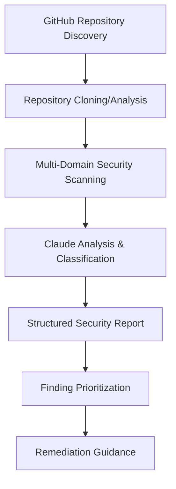

# SecurityAgents Local Prototype - GitHub Security Assessment

*Local-first security analysis prototype focusing on GitHub repository security assessment*

**Version**: 1.0  
**Date**: 2026-03-05  
**Scope**: Identification-only security assessment of GitHub projects

---

## Prototype Objectives

### Primary Goal
Build a local AI-powered security assessment tool that identifies security issues across all GitHub repositories without requiring cloud infrastructure or external API integrations.

### Success Criteria
- **Comprehensive Coverage**: Analyze all accessible GitHub repositories
- **Multi-Domain Assessment**: Code security, dependency vulnerabilities, configuration issues, secrets exposure
- **Actionable Reports**: Structured findings with severity classification and remediation guidance
- **Local Execution**: No external dependencies beyond GitHub CLI and local tools

---

## Architecture Overview

### Local-First Design
```
Local Machine
├── Claude (via OpenClaw)
├── GitHub CLI (gh)
├── Coding Agents (Codex/Claude Code)
├── Git repositories (local clones)
└── Security Analysis Tools
    ├── Secret scanning (git-secrets, truffhog-like)
    ├── Dependency analysis (npm audit, etc.)
    ├── Code analysis (grep patterns, AST parsing)
    └── Configuration review
```

### Data Flow


---

## Implementation Plan

### Phase 1: Repository Discovery & Inventory (Week 1)

#### 1.1 GitHub Repository Enumeration
**Objective**: Discover and catalog all accessible repositories

**Implementation**:
```bash
# List all repositories accessible to authenticated user
gh repo list --limit 1000 --json name,owner,visibility,language,updatedAt

# Include organization repositories
gh api user/orgs --jq '.[].login' | while read org; do
  gh repo list $org --limit 1000 --json name,owner,visibility,language,updatedAt
done
```

**Output**: Repository inventory with metadata (language, visibility, last update)

#### 1.2 Risk-Based Prioritization
**Criteria**:
- **High Priority**: Public repositories, recent activity, sensitive languages (Go, Python, JavaScript)
- **Medium Priority**: Private repositories with recent commits
- **Low Priority**: Archived or stale repositories

### Phase 2: Multi-Domain Security Analysis (Week 1-2)

#### 2.1 Secret Detection & Exposure Analysis
**Objective**: Identify committed secrets, API keys, credentials

**Local Tools & Techniques**:
```bash
# Git history analysis for secrets
git log --all --full-history --source -- '*.env*' '*.key*' '*.pem*'

# Pattern-based secret detection
grep -r -E "(password|secret|key|token|api)" --include="*.js" --include="*.py" --include="*.go" .

# Environment file detection
find . -name "*.env*" -o -name "*.key" -o -name "*.pem" -o -name "config.*"
```

**Advanced Analysis**: Use coding agent to analyze patterns and context

#### 2.2 Dependency Vulnerability Assessment
**Objective**: Identify vulnerable dependencies and outdated packages

**Language-Specific Analysis**:
```bash
# Node.js projects
npm audit --json 2>/dev/null || echo "No package.json"

# Python projects  
pip-audit --format=json 2>/dev/null || echo "No requirements.txt/setup.py"

# Go projects
govulncheck ./... 2>/dev/null || echo "No go.mod"

# Ruby projects
bundle audit --format json 2>/dev/null || echo "No Gemfile"
```

#### 2.3 Code Security Analysis
**Objective**: Identify common security anti-patterns and vulnerabilities

**Analysis Categories**:
- **Input Validation**: SQL injection, XSS, command injection vectors
- **Authentication/Authorization**: Weak auth patterns, privilege escalation
- **Cryptography**: Weak algorithms, hardcoded keys, improper key management
- **Data Handling**: Information leakage, insecure storage patterns

**Implementation**: Coding agent with security-focused prompts

#### 2.4 Configuration Security Review
**Objective**: Assess security configuration across the development ecosystem

**Assessment Areas**:
- **GitHub Security Settings**: Branch protection, security features enablement
- **CI/CD Configuration**: Workflow security, secrets management
- **Docker Security**: Dockerfile best practices, base image security
- **Infrastructure as Code**: Terraform/CloudFormation security configurations

### Phase 3: AI-Powered Analysis & Reporting (Week 2)

#### 3.1 Claude-Powered Security Intelligence
**Capabilities**:
- **Context-Aware Analysis**: Understanding business logic and security implications
- **False Positive Reduction**: Distinguishing real issues from benign patterns
- **Risk Assessment**: Business impact analysis based on repository purpose and data sensitivity
- **Remediation Prioritization**: Risk-based ordering with effort estimation

#### 3.2 Structured Reporting System
**Report Structure**:
```yaml
security_assessment:
  repository:
    name: "project-name"
    owner: "username"
    visibility: "public/private"
    languages: ["javascript", "python"]
    last_updated: "2026-03-05"
  
  executive_summary:
    risk_level: "high/medium/low"
    critical_findings: 2
    high_findings: 5
    medium_findings: 12
    low_findings: 8
  
  findings:
    - id: "SEC-001"
      category: "secrets"
      severity: "critical"
      title: "Hardcoded API Key in Configuration"
      description: "AWS access key found in config.js"
      location: "src/config.js:15"
      evidence: "AKIAI..."
      risk: "Unauthorized AWS resource access"
      remediation: "Move to environment variables"
      effort: "low"
  
  recommendations:
    immediate_actions: ["Remove exposed secrets", "Enable GitHub secret scanning"]
    strategic_improvements: ["Implement pre-commit hooks", "Add security testing to CI"]
```

---

## Technical Implementation

### Tool Integration Strategy

#### GitHub CLI Integration
```python
# Repository analysis workflow
def analyze_repository(repo_name, owner):
    # Clone repository for analysis
    clone_cmd = f"gh repo clone {owner}/{repo_name} /tmp/analysis/{repo_name}"
    
    # Gather repository metadata
    metadata = gh_api_call(f"repos/{owner}/{repo_name}")
    
    # Check security settings
    security_settings = analyze_github_security_settings(owner, repo_name)
    
    return {
        'metadata': metadata,
        'security_settings': security_settings,
        'local_path': f'/tmp/analysis/{repo_name}'
    }
```

#### Coding Agent Security Analysis
```bash
# Deploy coding agent for security analysis
bash pty:true workdir:/tmp/analysis/project background:true command:"claude exec '
Perform a comprehensive security analysis of this codebase:

1. SECRET DETECTION:
   - Scan for hardcoded secrets, API keys, passwords
   - Check environment files and configuration
   - Analyze git history for exposed credentials

2. CODE SECURITY:
   - Identify SQL injection vulnerabilities
   - Check for XSS attack vectors  
   - Review authentication and authorization patterns
   - Assess input validation and sanitization

3. DEPENDENCY ANALYSIS:
   - Check for vulnerable dependencies
   - Identify outdated packages with security implications
   - Assess supply chain security risks

4. CONFIGURATION SECURITY:
   - Review CI/CD security configuration
   - Assess Docker/container security if present
   - Check for insecure defaults or configurations

Provide findings in structured format with:
- Severity level (critical/high/medium/low)
- Specific location (file:line)
- Security impact description
- Recommended remediation steps

Focus on identification only - no fixes needed.
'"
```

### Local Security Tool Integration

#### Secret Detection Pipeline
```bash
# Multi-tool secret detection approach
detect_secrets() {
    local repo_path=$1
    
    # Git history analysis
    git -C "$repo_path" log --all --full-history --oneline | head -100
    
    # Pattern-based detection
    grep -r -i -E "(api[_-]?key|password|secret|token)" "$repo_path" --include="*.js" --include="*.py" --include="*.go" --include="*.rb" --include="*.java" --exclude-dir=node_modules --exclude-dir=.git
    
    # Environment file scan
    find "$repo_path" \( -name "*.env*" -o -name "*.key" -o -name "*.pem" -o -name "config.*" \) -not -path "*/node_modules/*" -not -path "*/.git/*"
}
```

#### Dependency Vulnerability Scanner
```bash
# Language-agnostic vulnerability assessment
assess_dependencies() {
    local repo_path=$1
    cd "$repo_path"
    
    # Node.js
    if [[ -f "package.json" ]]; then
        npm audit --json 2>/dev/null || echo "npm audit failed"
    fi
    
    # Python
    if [[ -f "requirements.txt" ]] || [[ -f "setup.py" ]] || [[ -f "pyproject.toml" ]]; then
        python -m pip install pip-audit 2>/dev/null
        pip-audit --format=json 2>/dev/null || echo "pip-audit not available"
    fi
    
    # Go
    if [[ -f "go.mod" ]]; then
        go install golang.org/x/vuln/cmd/govulncheck@latest 2>/dev/null
        govulncheck ./... 2>/dev/null || echo "govulncheck not available"
    fi
    
    # Ruby
    if [[ -f "Gemfile" ]]; then
        bundle audit --format json 2>/dev/null || echo "bundle-audit not available"
    fi
}
```

---

## Expected Findings Categories

### High-Severity Issues
- **Exposed Secrets**: API keys, database credentials, private keys in code or history
- **SQL Injection**: Direct query construction with user input
- **Command Injection**: Unsanitized input passed to system commands
- **Authentication Bypass**: Weak or missing authentication mechanisms

### Medium-Severity Issues
- **Vulnerable Dependencies**: Outdated packages with known CVEs
- **XSS Vulnerabilities**: Insufficient input sanitization for web applications
- **Insecure Configurations**: Default credentials, overprivileged access
- **Information Disclosure**: Debug information, stack traces, sensitive comments

### Low-Severity Issues
- **Security Headers**: Missing security headers in web applications
- **Weak Cryptography**: Use of deprecated algorithms or weak key sizes
- **Input Validation**: Missing validation for non-security-critical inputs
- **Configuration Hardening**: Opportunities for security configuration improvements

---

## Success Metrics

### Coverage Metrics
| Metric | Target | Measurement |
|--------|--------|-------------|
| **Repository Coverage** | 100% of accessible repos | GitHub API enumeration vs analyzed |
| **Language Coverage** | Top 5 languages analyzed | Language-specific tool coverage |
| **Security Domain Coverage** | 4 domains (secrets, deps, code, config) | Analysis module completion |

### Quality Metrics
| Metric | Target | Measurement |
|--------|--------|-------------|
| **Finding Accuracy** | >85% true positives | Manual validation sample |
| **Severity Classification** | >90% appropriate severity | Expert review of findings |
| **Actionable Recommendations** | 100% findings have remediation | Review of report quality |

### Performance Metrics
| Metric | Target | Measurement |
|--------|--------|-------------|
| **Analysis Speed** | <10 minutes per medium repo | Time tracking per repository |
| **Resource Usage** | <4GB memory, <50% CPU | System monitoring |
| **Scalability** | Handle 50+ repositories | Batch processing validation |

---

## Development Timeline

### Week 1: Foundation & Discovery
- **Days 1-2**: Repository discovery and enumeration system
- **Days 3-4**: Basic secret detection and dependency analysis
- **Days 5-7**: Code security analysis framework with coding agents

### Week 2: Intelligence & Reporting
- **Days 8-10**: Claude-powered analysis and classification
- **Days 11-12**: Structured reporting system
- **Days 13-14**: Testing, validation, and documentation

---

## Risk Mitigation

### Technical Risks
| Risk | Mitigation |
|------|------------|
| **Rate Limiting** | Implement intelligent delays, use local clones |
| **Tool Dependencies** | Graceful fallbacks when tools unavailable |
| **Large Repository Analysis** | Size limits, sampling for massive codebases |
| **False Positives** | Multi-tool validation, Claude context analysis |

### Operational Risks
| Risk | Mitigation |
|------|------------|
| **Data Privacy** | Local-only processing, no external uploads |
| **Repository Access** | Clear scope definition, respect access controls |
| **Analysis Overhead** | Efficient cloning, cleanup procedures |

---

## Future Scaling Path

### Phase 2: Cloud Integration
- AWS Bedrock for scaled Claude analysis
- CloudWatch for monitoring and alerting
- S3 for historical analysis storage

### Phase 3: Enterprise Features
- CrowdStrike MCP for threat intelligence correlation
- Atlassian MCP for automated ticket creation
- Real-time monitoring and continuous assessment

---

## Getting Started

### Prerequisites
```bash
# Required tools
gh auth status  # GitHub CLI authenticated
which git      # Git available
which npm      # Node.js ecosystem (if analyzing JS projects)
which python3  # Python ecosystem (if analyzing Python projects)
```

### Quick Start Commands
```bash
# Create working directory
mkdir -p ~/security-assessment/repos
cd ~/security-assessment

# List all accessible repositories
gh repo list --limit 1000 --json name,owner,visibility,language > repository-inventory.json

# Start with highest-risk repository
gh repo clone your-username/your-most-critical-repo repos/critical-repo

# Launch security analysis
bash pty:true workdir:repos/critical-repo background:true command:"claude exec 'Comprehensive security analysis - identify all security issues'"
```

---

*Ready to begin local security assessment prototype development!*