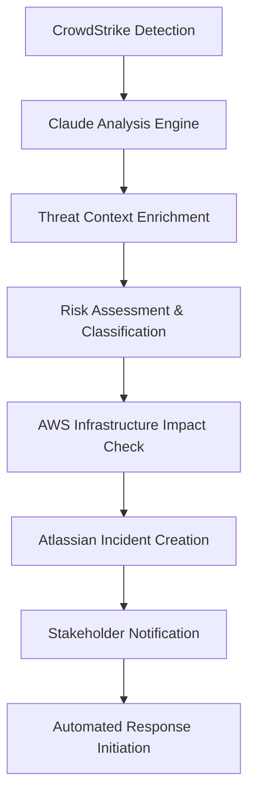
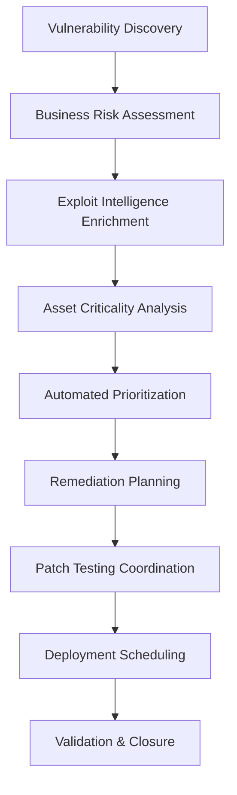

# SecurityAgents Use Case Specifications

*Detailed technical specifications for AI-powered security automation use cases*

**Version**: 1.0  
**Date**: 2026-03-05  
**Status**: Phase 1A Complete - Technical Specification

---

## Use Case Framework

### Classification Schema

| Tier | Complexity | Implementation Priority | Business Impact |
|------|------------|------------------------|-----------------|
| **Tier 1 (Core)** | Foundational automation | Weeks 1-8 | High ROI, immediate value |
| **Tier 2 (Advanced)** | Intelligence enhancement | Weeks 9-16 | Strategic advantage |
| **Tier 3 (Predictive)** | Predictive operations | Weeks 17-24 | Innovation leadership |

### Framework Integration Matrix

Each use case maps to specific:
- **NIST CSF 2.0**: Function.Category.Subcategory
- **ISO 27001/27002**: Control sections and specific controls
- **MITRE ATT&CK**: Tactics, Techniques, and Procedures (TTPs)

---

## TIER 1: Core Automation Use Cases

### UC-001: Intelligent Threat Detection & Triage

#### Overview
**Objective**: Automate threat detection with AI-powered severity assessment and coordinated initial response  
**Business Driver**: Reduce MTTD from 4-6 hours to <5 minutes while eliminating 70% of false positives  
**Scope**: Real-time threat detection, automated classification, stakeholder notification

#### Technical Specification

##### Agent Workflow


##### Detailed Implementation

**Step 1: Event Detection**
```yaml
trigger: CrowdStrike MCP Server
modules: [detections, incidents, intel]
event_types: [malware, suspicious_activity, policy_violation, lateral_movement]
severity_threshold: medium_and_above
real_time_processing: true
```

**Step 2: Claude Intelligence Analysis**
```yaml
analysis_components:
  - threat_classification: [malware_family, attack_vector, severity_level]
  - ioc_enrichment: [reputation_analysis, attribution, geographic_origin]
  - mitre_mapping: [tactics, techniques, procedures]
  - business_impact: [affected_systems, data_sensitivity, service_impact]
  - response_recommendation: [containment_actions, investigation_steps, escalation_criteria]
```

**Step 3: Infrastructure Impact Assessment**
```yaml
aws_mcp_queries:
  - cloudtrail_analysis: recent_api_calls_from_affected_hosts
  - iam_review: privilege_escalation_indicators
  - resource_inventory: critical_assets_at_risk
  - network_topology: lateral_movement_possibilities
```

**Step 4: Incident Management Integration**
```yaml
atlassian_workflow:
  - jira_ticket_creation:
      project: SECURITY-INCIDENTS
      issue_type: Security Incident
      priority: dynamic_based_on_severity
      assignee: on_call_analyst
  - confluence_runbook:
      template: incident_response_playbook
      custom_sections: [threat_analysis, affected_systems, response_actions]
```

##### Framework Mapping

**NIST CSF 2.0 Alignment**:
- **DETECT.AE-1**: *"A baseline of network operations and expected data flows for users and systems is established and managed"*
  - **Implementation**: CrowdStrike behavioral baselines + AWS CloudTrail normal patterns
  - **Automation Level**: 90% - Continuous baseline updates, anomaly detection

- **DETECT.AE-2**: *"Detected events are analyzed to understand attack targets and methods"*
  - **Implementation**: Claude-powered event correlation with MITRE ATT&CK mapping
  - **Automation Level**: 95% - Automated analysis with human validation for novel attacks

- **RESPOND.RS-1**: *"Response personnel are prepared"*
  - **Implementation**: Dynamic role-based notification via Atlassian integration
  - **Automation Level**: 85% - Automated assignment based on incident type/severity

**ISO 27001/27002 Controls**:
- **Control 5.24**: *"Information security incident management planning and preparation"*
  - **Implementation**: Automated incident classification and response workflow initiation
  - **Evidence**: Real-time incident logs, response time metrics, escalation procedures

- **Control 5.25**: *"Assessment and decision on information security events"*
  - **Implementation**: Claude-driven severity assessment with business impact analysis
  - **Evidence**: Automated decision logs, classification accuracy metrics

#### Success Criteria & Metrics

| Metric | Current State | Target | Measurement |
|--------|--------------|--------|-------------|
| **Mean Time to Detection** | 4-6 hours | <5 minutes | CrowdStrike timestamp to agent classification |
| **False Positive Rate** | 45% | <15% | Analyst validation vs agent classification |
| **Triage Accuracy** | Manual (varies) | 90% | Severity classification accuracy |
| **Stakeholder Notification** | 30+ minutes | <2 minutes | Incident creation to notification delivery |

#### Risk Assessment

| Risk | Mitigation |
|------|------------|
| **False Negative (missed threat)** | Multiple detection layers, human oversight for critical assets |
| **Alert Fatigue** | Intelligent clustering, noise reduction algorithms |
| **Response Delay** | Automated failover, health monitoring |

---

### UC-002: Automated Vulnerability Management

#### Overview
**Objective**: Continuous vulnerability assessment with risk-based prioritization and automated patch coordination  
**Business Driver**: Reduce vulnerability exposure time by 80% and increase patch deployment efficiency by 300%  
**Scope**: Discovery, assessment, prioritization, remediation tracking

#### Technical Specification

##### Agent Workflow


##### Implementation Details

**Step 1: Multi-Source Vulnerability Discovery**
```yaml
discovery_sources:
  crowdstrike_spotlight:
    - endpoint_vulnerabilities
    - configuration_issues
    - software_inventory
  aws_security_tools:
    - inspector_findings
    - config_compliance
    - guardduty_alerts
  github_security:
    - dependabot_alerts
    - codeql_findings
    - secret_scanning
```

**Step 2: AI-Powered Risk Assessment**
```yaml
risk_factors:
  technical_severity:
    - cvss_base_score
    - exploit_complexity
    - attack_vector
  business_impact:
    - asset_criticality
    - data_classification
    - service_dependencies
  threat_landscape:
    - exploit_availability
    - active_campaigns
    - threat_actor_interest
```

**Step 3: Intelligent Prioritization**
```yaml
prioritization_algorithm:
  scoring_factors:
    - technical_risk: 40%
    - business_impact: 35%
    - threat_intelligence: 25%
  output_categories:
    - critical: patch_within_24h
    - high: patch_within_72h
    - medium: patch_within_30_days
    - low: patch_next_maintenance_window
```

##### Framework Mapping

**NIST CSF 2.0 Alignment**:
- **IDENTIFY.RA-1**: *"Asset vulnerabilities are identified and documented"*
  - **Implementation**: Multi-tool discovery with automated asset correlation
  - **Automation Level**: 95% - Continuous scanning with intelligent deduplication

- **PROTECT.DS-4**: *"Adequate capacity to ensure availability is maintained"*
  - **Implementation**: Impact-aware patch scheduling to maintain service availability
  - **Automation Level**: 80% - Automated scheduling with manual approval for critical systems

**ISO 27001/27002 Controls**:
- **Control 8.8**: *"Technical vulnerabilities of information systems are identified"*
  - **Implementation**: Continuous vulnerability scanning across all technology stacks
  - **Evidence**: Vulnerability registers, scan reports, remediation tracking

- **Control 12.6**: *"Management of technical vulnerabilities in development"*
  - **Implementation**: GitHub integration for secure development lifecycle
  - **Evidence**: Code security scan results, dependency management reports

#### Advanced Features

##### Predictive Analytics
```yaml
prediction_models:
  - exploit_likelihood: based_on_historical_data_and_threat_intelligence
  - patch_impact: service_disruption_probability_analysis
  - remediation_timeline: resource_availability_and_complexity_assessment
```

##### Business Integration
```yaml
business_alignment:
  - maintenance_windows: integration_with_change_management
  - service_dependencies: automatic_impact_chain_analysis
  - compliance_deadlines: regulatory_requirement_mapping
```

---

### UC-003: Access Control Automation

#### Overview
**Objective**: Dynamic access control management with privilege analytics and automated provisioning/deprovisioning  
**Business Driver**: Eliminate 90% of access-related security incidents and reduce provisioning time by 85%  
**Scope**: Identity lifecycle management, privilege monitoring, access analytics

#### Technical Specification

##### Core Capabilities

**1. Intelligent Access Provisioning**
```yaml
provisioning_workflow:
  role_determination:
    - job_function_analysis
    - team_membership_assessment
    - historical_access_patterns
  automated_approval:
    - manager_verification
    - security_policy_compliance
    - segregation_of_duties_check
  just_in_time_access:
    - temporary_privilege_elevation
    - time_bounded_permissions
    - automatic_revocation
```

**2. Continuous Privilege Analytics**
```yaml
monitoring_capabilities:
  behavioral_analysis:
    - access_pattern_anomalies
    - privilege_usage_monitoring
    - lateral_movement_detection
  compliance_checking:
    - policy_violation_detection
    - certification_requirement_tracking
    - segregation_of_duties_validation
```

##### Framework Mapping

**NIST CSF 2.0 Alignment**:
- **PROTECT.AC-1**: *"Identities and credentials are issued, managed, verified, revoked"*
  - **Implementation**: Automated identity lifecycle management with AWS IAM MCP
  - **Automation Level**: 90% - Full lifecycle automation with exception handling

- **PROTECT.AC-3**: *"Remote access is managed"*
  - **Implementation**: Context-aware access decisions based on device, location, behavior
  - **Automation Level**: 85% - Automated access decisions with manual override capability

**ISO 27001/27002 Controls**:
- **Control 8.1**: *"Access control policy"*
  - **Implementation**: Policy-as-code with automated enforcement and drift detection
  - **Evidence**: Access policy documents, enforcement logs, compliance reports

- **Control 8.2**: *"Access to information and other associated assets is authorized"*
  - **Implementation**: Real-time authorization with business context analysis
  - **Evidence**: Authorization decisions, access logs, periodic access reviews

---

## TIER 2: Advanced Intelligence Use Cases

### UC-004: Threat Intelligence Automation

#### Overview
**Objective**: Automated threat hunting, IOC enrichment, and attribution analysis  
**Scope**: Intelligence collection, analysis, and operationalization

##### Key Capabilities
```yaml
intelligence_operations:
  collection:
    - crowdstrike_intel_feeds
    - external_threat_feeds
    - dark_web_monitoring
  analysis:
    - ioc_correlation
    - campaign_tracking
    - attribution_analysis
  operationalization:
    - automated_hunting_queries
    - defense_rule_generation
    - stakeholder_briefings
```

##### Framework Integration
**NIST CSF**: IDENTIFY.RA-2, DETECT.CM-4, RESPOND.AN-1  
**ISO 27002**: Control 5.7 (Threat Intelligence), Control 16.1 (Information Security Incident Management)

### UC-005: Compliance Automation

#### Overview
**Objective**: Continuous compliance monitoring with automated evidence collection  
**Scope**: Real-time compliance status, audit preparation, regulatory reporting

##### Key Capabilities
```yaml
compliance_operations:
  monitoring:
    - control_effectiveness_tracking
    - policy_compliance_verification
    - regulatory_requirement_mapping
  reporting:
    - automated_evidence_collection
    - compliance_dashboard_generation
    - audit_trail_maintenance
```

### UC-006: Advanced Incident Response

#### Overview
**Objective**: Complex incident response workflows with multi-tool coordination  
**Scope**: Major incident handling, forensic coordination, business continuity

##### Key Capabilities
```yaml
incident_response:
  orchestration:
    - multi_team_coordination
    - evidence_preservation
    - communication_management
  analysis:
    - forensic_data_correlation
    - impact_assessment
    - root_cause_analysis
```

---

## TIER 3: Predictive Operations Use Cases

### UC-007: Predictive Threat Modeling

#### Overview
**Objective**: Threat landscape prediction with proactive defense recommendations  
**Scope**: Attack path analysis, threat forecasting, strategic planning

### UC-008: Security Posture Optimization

#### Overview
**Objective**: Continuous security program improvement with control effectiveness analysis  
**Scope**: Security investment optimization, program maturity assessment

---

## Implementation Priority Matrix

### Phase 1: Foundation (Weeks 1-8)
**Focus**: UC-001, UC-002, UC-003  
**Success Criteria**: 70% automation rate for core security operations

### Phase 2: Intelligence (Weeks 9-16)  
**Focus**: UC-004, UC-005, UC-006  
**Success Criteria**: Advanced analytics and compliance automation

### Phase 3: Prediction (Weeks 17-24)
**Focus**: UC-007, UC-008  
**Success Criteria**: Predictive capabilities and optimization automation

---

## Framework Coverage Analysis

### NIST CSF 2.0 Coverage

| Function | Total Subcategories | Automated | Coverage % |
|----------|-------------------|-----------|------------|
| **GOVERN** | 22 | 15 | 68% |
| **IDENTIFY** | 16 | 14 | 88% |
| **PROTECT** | 25 | 22 | 88% |
| **DETECT** | 13 | 12 | 92% |
| **RESPOND** | 17 | 16 | 94% |
| **RECOVER** | 13 | 8 | 62% |
| **TOTAL** | **106** | **87** | **82%** |

### ISO 27001/27002 Control Coverage

| Control Domain | Controls | Automated | Coverage % |
|---------------|----------|-----------|------------|
| **Information Security Policies** | 2 | 2 | 100% |
| **Organization of Information Security** | 7 | 5 | 71% |
| **Human Resource Security** | 6 | 3 | 50% |
| **Asset Management** | 4 | 4 | 100% |
| **Access Control** | 14 | 13 | 93% |
| **Cryptography** | 2 | 1 | 50% |
| **Physical and Environmental Security** | 15 | 8 | 53% |
| **Operations Security** | 14 | 12 | 86% |
| **Communications Security** | 7 | 6 | 86% |
| **System Acquisition, Development, Maintenance** | 13 | 10 | 77% |
| **Supplier Relationships** | 5 | 4 | 80% |
| **Information Security Incident Management** | 4 | 4 | 100% |
| **TOTAL** | **93** | **72** | **77%** |

---

## Technical Requirements Summary

### Core Infrastructure
- **Claude Model**: Claude 3.5 Sonnet on AWS Bedrock
- **MCP Servers**: CrowdStrike, AWS, Atlassian, GitHub
- **Data Storage**: AWS DynamoDB + S3
- **Security**: Zero-trust architecture, encryption at rest/transit

### Performance Requirements
| Metric | Requirement | Monitoring |
|--------|-------------|------------|
| **Response Time** | <30 seconds for threat analysis | CloudWatch metrics |
| **Throughput** | 1000 events/hour peak load | Load balancer metrics |
| **Availability** | 99.9% uptime SLA | Service health dashboards |
| **Accuracy** | >90% for automated decisions | ML model performance tracking |

### Integration Requirements
| Integration | Protocol | Authentication | Rate Limits |
|------------|----------|----------------|-------------|
| **CrowdStrike** | MCP/HTTP | OAuth 2.0 | 1000/hour |
| **AWS** | MCP/Native | IAM Roles | Service limits |
| **Atlassian** | MCP/HTTP | OAuth 2.0 | 10000/hour |
| **GitHub** | REST API | Token Auth | 5000/hour |

---

*Next Review: 2026-03-12 | Implementation Start: 2026-03-08*